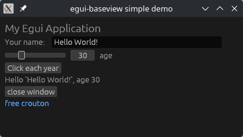

# egui-baseview
[](https://github.com/BillyDM/nih-plug/blob/main/crates/egui-baseview/LICENSE-MIT)

A [`baseview`](https://github.com/RustAudio/baseview) backend for [`egui`](https://github.com/emilk/egui)

<div align="center">
    
</div>

## How to use with your own custom plugin framework

Add the following to your `Cargo.toml`:

```toml
egui-baseview = { git = "https://github.com/BillyDM/nih-plug", branch = "main" }
```

or if you want to use a specific revision:

```toml
egui-baseview = { git = "https://github.com/BillyDM/nih-plug", rev = "8225a2d94a7a27a212c64aa814467801faa9585c" }
```

## Prerequisites

### Linux

Install dependencies, e.g.,

```sh
sudo apt-get install libx11-dev libxcursor-dev libxcb-dri2-0-dev libxcb-icccm4-dev libx11-xcb-dev mesa-common-dev libgl1-mesa-dev libglu1-mesa-dev
```
