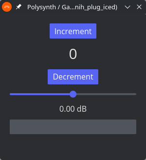

# iced_baseview

[](https://github.com/BillyDM/nih-plug/blob/main/crates/iced-baseview/LICENSE-MIT)

A [`baseview`](https://github.com/RustAudio/baseview) backend for [`Iced`](https://github.com/hecrj/iced)

<div align="center">
    
</div>

## How to use with your own custom plugin framework

Add the following to your `Cargo.toml`:

```toml
iced-baseview = { git = "https://github.com/BillyDM/nih-plug", branch = "main" }
```

or if you want to use a specific revision:

```toml
iced-baseview = { git = "https://github.com/BillyDM/nih-plug", rev = "57c8e47de03cb8d9a5b5455caf65ca2b6d55edf3" }
```

## Prerequisites

### Linux

Install dependencies, e.g.,

```sh
sudo apt-get install libx11-dev libxcursor-dev libxcb-dri2-0-dev libxcb-icccm4-dev libx11-xcb-dev mesa-common-dev libgl1-mesa-dev libglu1-mesa-dev
```
